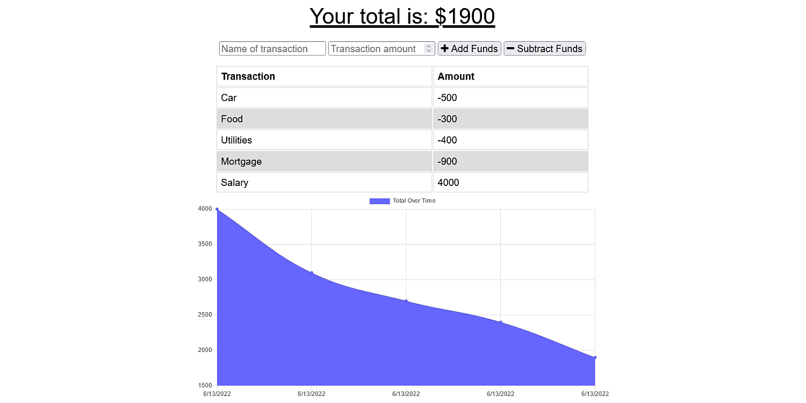

# Watch Your Money

## Description
A simple and quick budget tracker with offline functionality that can be installed as a web app.

## Table of Contents
* [Features](#features)
* [Technologies](#technologies)
* [Installation](#installation)
* [Usage](#usage)
* [Demonstration](#demonstration)

## Features
A clean web interface interface and a MongoDB based API backend that charts income and expenses.
Web App functonality for installation with supported browsers and operating systems.
Offline functionality that automatically syncs when back online.

## Technologies
Javascript
Node.js
Express
Chart.js
IndexedDB
MongoDB
Mongoose
Heroku

## Installation
Clone the repository and install any dependencies with NPM. Modify to your liking and deploy on Heroku.

## Usage
Enter and track your earnings and spending to stay afloat and avoid going into debt.

## Demonstration
Here is a [Live Demonstration](https://faceless-budget-tracker.herokuapp.com)

## Screenshot

